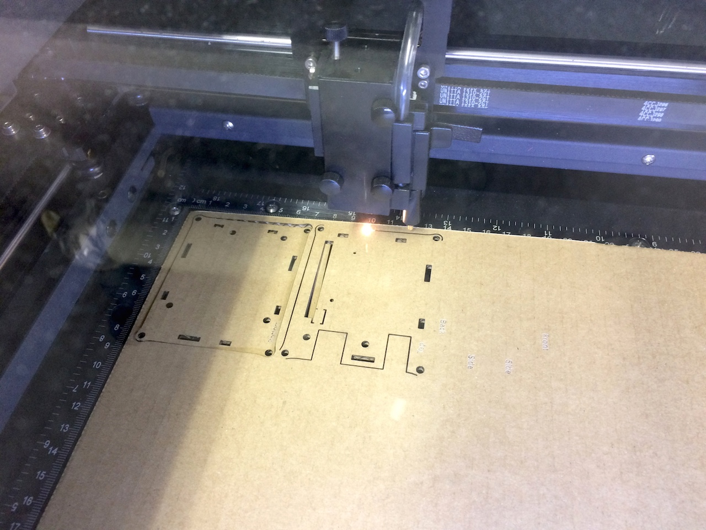
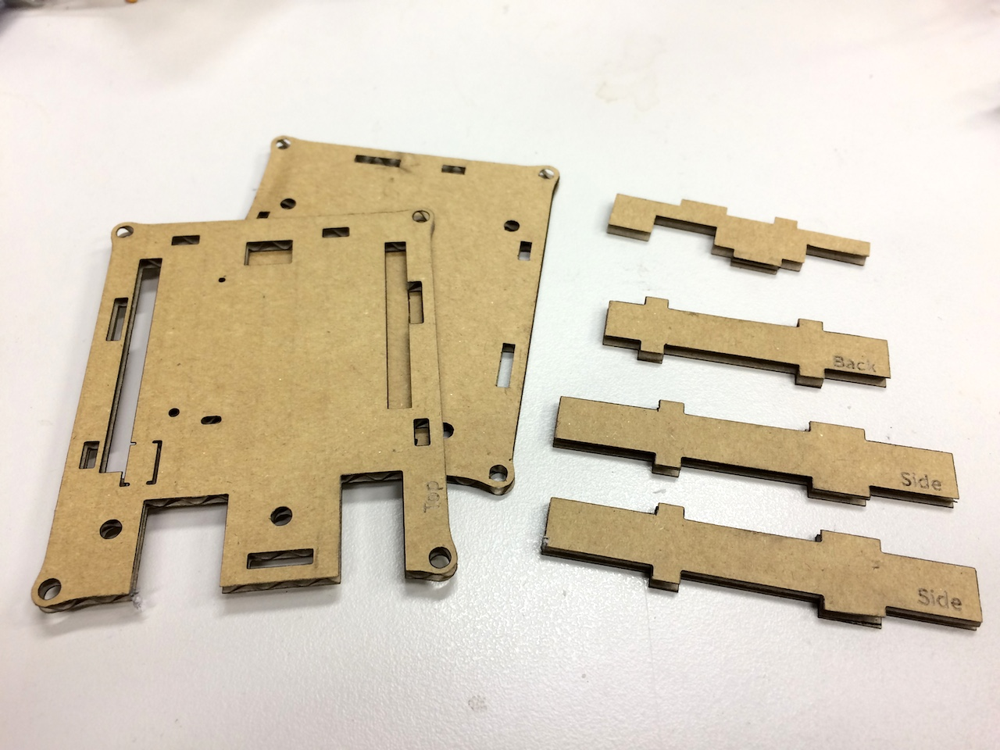
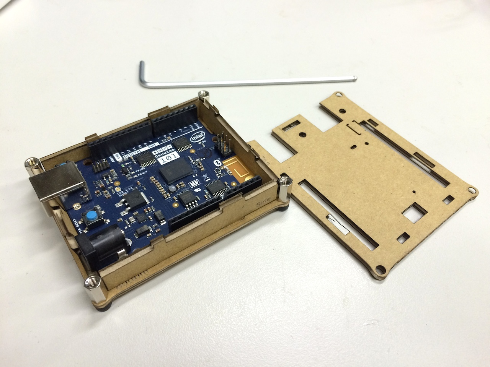
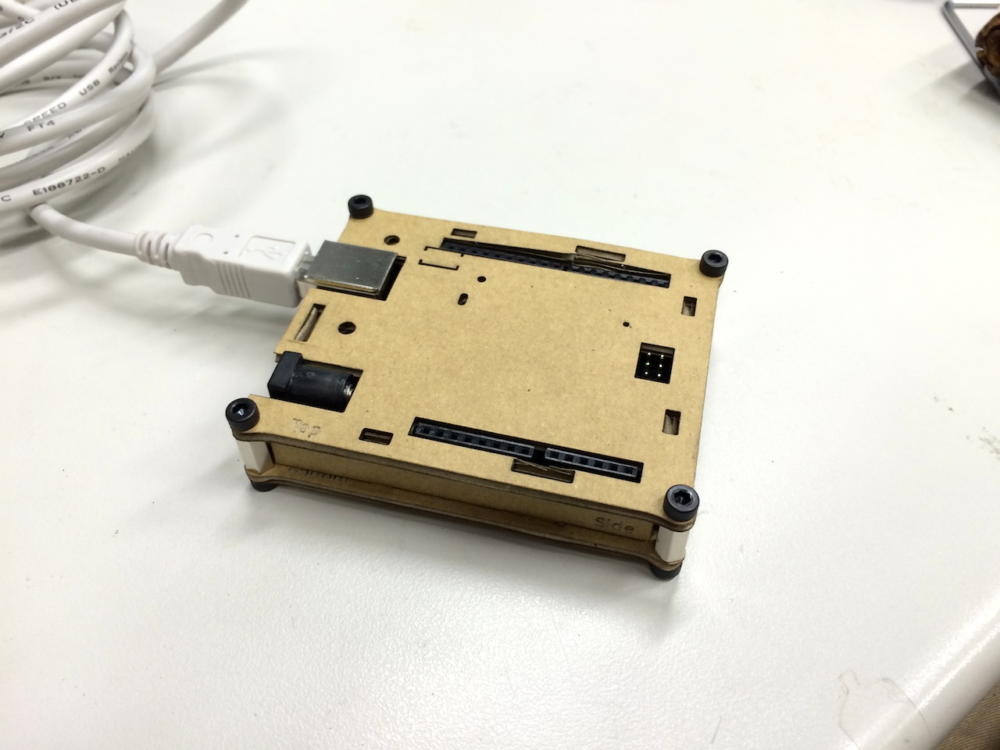

# arduino101-enclosure
Enclosure for [Arduino/Genuino 101](https://www.arduino.cc/en/Main/ArduinoBoard101) made by laser cutter

### Licence
CC BY-NC-SA 4.0, [Detail](https://creativecommons.org/licenses/by-nc-sa/4.0/)

